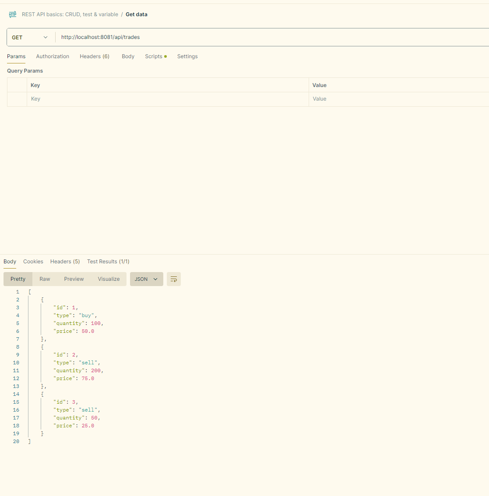

# Trade Transaction Microservice with Spring Boot

This is a simple Trade Transaction microservice built using Spring Boot. The application demonstrates the use of RESTful APIs, JPA, and H2 in-memory database with basic CRUD operations for managing trade transactions.

## Project Structure

```
src/main/java/com/dtcc/trade
|-- TradeMicroserviceApplication.java   # Main Application Class
|-- controller
|   |-- TradeController.java            # REST Controller for trade endpoints
|-- service
|   |-- TradeService.java               # Business logic for trade operations
|-- repository
|   |-- TradeRepository.java            # JPA repository for trade persistence
|-- model
    |-- Trade.java                      # Trade entity class
```

## Technologies Used
- **Java 21**
- **Spring Boot 3.3.4**
- **Spring Data JPA**
- **H2 Database**
- **Maven**
- **Docker** (optional)

## Getting Started

### Prerequisites
Make sure you have the following installed on your local machine:
- **Java JDK 11+**
- **Maven**
- **Docker** (optional, for containerization)

### Steps to Run the Application

1. **Clone the Repository**:
   ```bash
   git clone https://github.com/yourusername/trade-microservice.git
   cd trade-microservice
   ```

2. **Build the Project**:
   Use Maven to build the project and download dependencies:
   ```bash
   mvn clean install
   ```

3. **Run the Application**:
   Run the Spring Boot application using Maven:
   ```bash
   mvn spring-boot:run
   ```

4. **Access the Application**:
   The application will be running at `http://localhost:8081/api/trades`.

    - **GET all trades**: `http://localhost:8081/api/trades`
    - **POST a new trade**: `http://localhost:8081/api/trades`
    - **PUT update trade**: `http://localhost:8081/api/trades/{id}`
    - **DELETE a trade**: `http://localhost:8081/api/trades/{id}`



### API Endpoints

- **GET /api/trades**: Fetch all trade transactions.
- **GET /api/trades/{id}**: Fetch a single trade by its ID.
- **POST /api/trades**: Create a new trade.
- **PUT /api/trades/{id}**: Update an existing trade.
- **DELETE /api/trades/{id}**: Delete a trade by ID.

### H2 Database

The application uses an in-memory H2 database. You can access the H2 database console at `http://localhost:8081/h2-console` using the following credentials:

- **JDBC URL**: `jdbc:h2:mem:testdb`
- **Username**: `sa`
- **Password**: (leave it empty)

### Testing

You can test the endpoints using **Postman**, **curl**, or any REST client.

For example, to create a new trade:
```bash
curl -X POST http://localhost:8081/api/trades -H "Content-Type: application/json" -d '{"type": "buy", "quantity": 100, "price": 50.0}'
```

### Docker Containerization (Optional)

To build and run the application in a Docker container:
1. **Build the Docker Image**:
   ```bash
   docker build -t trade-microservice .
   ```

2. **Run the Docker Container**:
   ```bash
   docker run -p 8081:8081 trade-microservice
   ```
