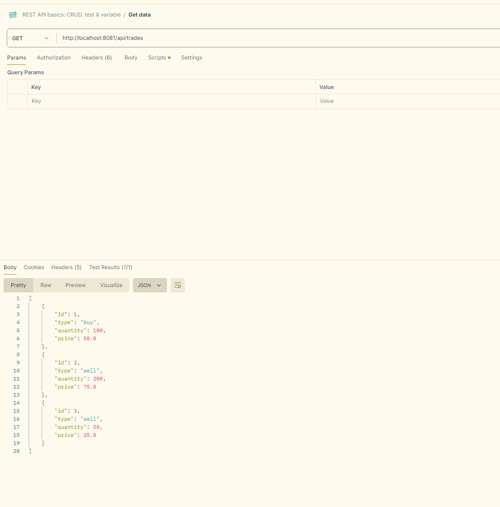
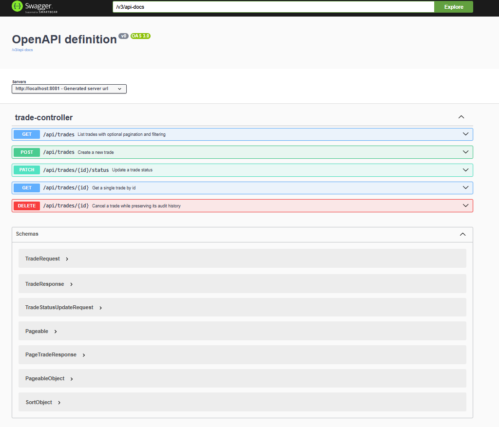
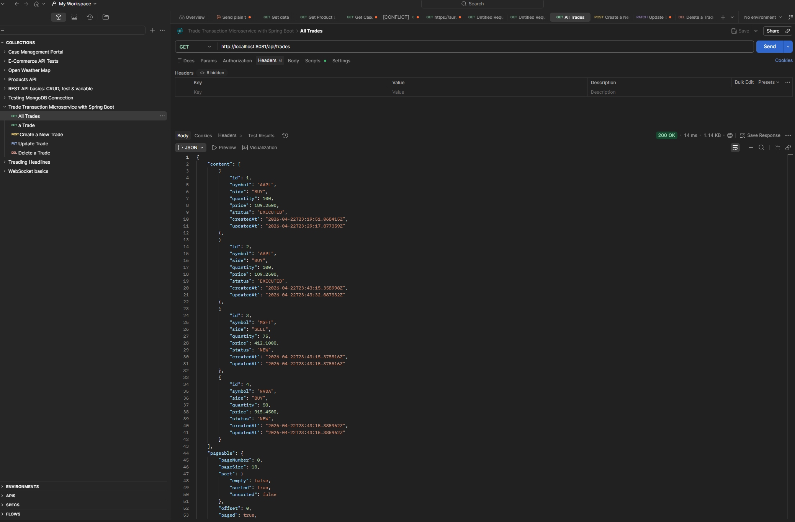
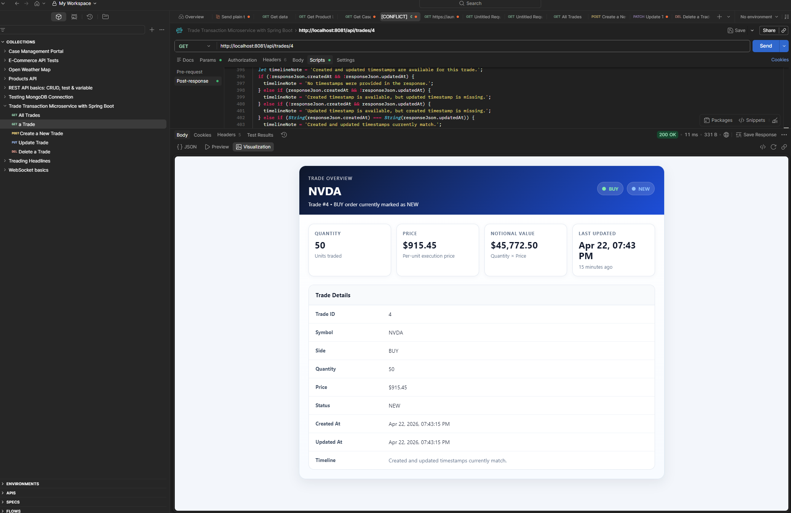

# Trade Order Management API

This project is a Spring Boot–based trade order management API that models a focused trade lifecycle workflow while demonstrating production-oriented backend engineering practices. It is designed as a portfolio project with an enterprise-style implementation approach, including PostgreSQL persistence, DTO-driven REST contracts, validation, consistent error handling, pageable and filterable retrieval, OpenAPI documentation, operational endpoints via Actuator, and containerized local infrastructure.

## Executive summary

The service manages trade records through a simple but realistic lifecycle:

- create a trade order
- retrieve trades individually or through filtered, paginated queries
- transition trade status through a dedicated endpoint
- cancel trades while preserving audit-oriented state changes

Although intentionally scoped for local development and portfolio use, the codebase is structured to reflect enterprise concerns such as API contract clarity, input validation, operational visibility, and predictable runtime configuration.

## Business and technical scope

The current implementation highlights:

- trade domain modeled with explicit lifecycle state
- DTO-based request and response contracts
- validation at the API boundary
- centralized JSON error handling
- PostgreSQL-backed persistence
- pageable and filterable listing endpoints
- OpenAPI and Swagger UI documentation
- Actuator health, info, and metrics endpoints
- Docker Compose for local infrastructure
- PowerShell automation for demo data seeding and status updates

## Domain model

The `Trade` entity includes:

- `id`
- `symbol`
- `side` (`BUY`, `SELL`)
- `quantity`
- `price`
- `status` (`NEW`, `CANCELLED`, `EXECUTED`)
- `createdAt`
- `updatedAt`

This keeps the model intentionally compact while still supporting a meaningful operational workflow.

## Architecture overview

The application follows a conventional layered Spring Boot architecture:

```text
Client / Script / Swagger UI
        |
        v
TradeController
        |
        v
TradeService
        |
        v
TradeRepository
        |
        v
PostgreSQL
```

Supporting concerns are handled through dedicated packages:

- `dto` for API contracts
- `exception` for standardized error responses
- `model` for domain and enum types
- `repository` for persistence access
- `service` for business logic and lifecycle rules

## Project structure

```text
src/main/java/com/dtcc/trade
|-- TradeMicroserviceApplication.java
|-- controller
|   |-- TradeController.java
|-- dto
|   |-- ApiErrorResponse.java
|   |-- TradeRequest.java
|   |-- TradeResponse.java
|   |-- TradeStatusUpdateRequest.java
|-- exception
|   |-- GlobalExceptionHandler.java
|   |-- TradeNotFoundException.java
|-- model
|   |-- Trade.java
|   |-- TradeSide.java
|   |-- TradeStatus.java
|-- repository
|   |-- TradeRepository.java
|-- service
    |-- TradeService.java
```

## Technology stack

- **Java 21**
- **Spring Boot 3.3.4**
- **Spring Web**
- **Spring Data JPA**
- **PostgreSQL**
- **Spring Validation**
- **Springdoc OpenAPI**
- **Spring Boot Actuator**
- **JUnit 5 / Mockito / MockMvc**
- **Docker / Docker Compose**

## API surface

### Core endpoints

- `GET /api/trades` - list trades with optional pagination and filtering
- `GET /api/trades/{id}` - retrieve a single trade by identifier
- `POST /api/trades` - create a new trade
- `PATCH /api/trades/{id}/status` - update trade lifecycle status
- `DELETE /api/trades/{id}` - cancel a trade

### Query capabilities

- `GET /api/trades?page=0&size=10`
- `GET /api/trades?status=NEW`
- `GET /api/trades?symbol=AAPL`

### Example request payload

```json
{
  "symbol": "AAPL",
  "side": "BUY",
  "quantity": 100,
  "price": 189.25
}
```

## API contract and validation

The API does not expose JPA entities directly. Instead, request and response payloads are mediated through DTOs to keep the external contract explicit and stable.

Validation rules currently include:

- a symbol is required
- side is required
- the quantity must be greater than zero
- price must be greater than zero

## Error handling

The service returns consistent JSON error responses through centralized exception handling.

Examples:

- `400 Bad Request` for invalid request payloads
- `404 Not Found` for missing trades

This pattern improves API usability and creates a more production-oriented consumer experience than default framework error responses.

## Operational readiness

The current implementation includes several operational features commonly expected in enterprise backend services:

- OpenAPI specification generation
- Swagger UI for interactive API exploration
- health endpoint exposure
- application info exposure
- metrics endpoint exposure
- externalized datasource configuration through environment variables

### Operational endpoints

- Swagger UI: `http://localhost:8081/swagger-ui.html`
- OpenAPI JSON: `http://localhost:8081/v3/api-docs`
- Actuator health: `http://localhost:8081/actuator/health`
- Actuator info: `http://localhost:8081/actuator/info`
- Actuator metrics: `http://localhost:8081/actuator/metrics`

## Local development runbook

### Prerequisites

- **Java 21**
- **Docker Desktop**

### Start PostgreSQL only, then run the application locally

```powershell
docker compose up -d postgres
```

```powershell
./mvnw.cmd spring-boot:run
```

### Default local database configuration

Unless overridden via environment variables, the application uses:

- `jdbc:postgresql://localhost:5433/tradedb`
- username: `postgres`
- password: `postgres`

The Docker PostgreSQL container is mapped to host port `5433` to avoid conflicts with an existing local PostgreSQL installation on `5432`.

### Run the full stack in Docker

```powershell
docker compose up --build
```

### Build and test

```powershell
./mvnw.cmd test
```

## PostgreSQL troubleshooting

If startup fails with `FATAL: database "tradedb" does not exist`, the most common cause is a previously initialized Docker volume.

### Option A: reset local PostgreSQL completely

```powershell
docker compose down -v
docker compose up -d postgres
./mvnw.cmd spring-boot:run
```

### Option B: keep the existing volume and create the database manually

```powershell
docker exec -it trade-postgres psql -U postgres -c "CREATE DATABASE tradedb;"
./mvnw.cmd spring-boot:run
```

`POSTGRES_DB` is only applied during first-time initialization of a fresh PostgreSQL data directory.

## Example API usage

Create a trade:

```bash
curl -X POST http://localhost:8081/api/trades \
  -H "Content-Type: application/json" \
  -d '{"symbol":"AAPL","side":"BUY","quantity":100,"price":189.25}'
```

Filter by status:

```bash
curl "http://localhost:8081/api/trades?status=NEW"
```

Update trade status:

```bash
curl -X PATCH http://localhost:8081/api/trades/1/status \
  -H "Content-Type: application/json" \
  -d '{"status":"EXECUTED"}'
```

Cancel a trade:

```bash
curl -X DELETE http://localhost:8081/api/trades/1
```

## PowerShell automation

To speed up local demos and recruiter walkthroughs, the repository includes `scripts/trades.ps1`.

### Seed demo trades

```powershell
.\scripts\trades.ps1 -Action seed -Count 5
```

### List trades

```powershell
.\scripts\trades.ps1 -Action list
```

### Filter trades

```powershell
.\scripts\trades.ps1 -Action list -Status NEW
.\scripts\trades.ps1 -Action list -Symbol AAPL
```

### Retrieve one trade

```powershell
.\scripts\trades.ps1 -Action get -Id 1
```

### Update status

```powershell
.\scripts\trades.ps1 -Action update-status -Id 1 -Status EXECUTED
```

### Cancel a trade

```powershell
.\scripts\trades.ps1 -Action delete -Id 1 -Confirm:$false
```

The script reads `scripts/trade-samples.json` first for repeatable demo payloads and generates additional valid random trades if more records are requested.

## Testing strategy

The repository includes a small but meaningful automated test suite:

- controller tests for creation, validation, and not-found behavior
- service tests for symbol normalization, lifecycle rules, and cancellation
- application context smoke test

This provides basic regression coverage across the HTTP layer, business logic, and application bootstrap path.

## Enterprise-oriented improvements are demonstrated

This project is intentionally modest in scope, but it reflects several practices that make a portfolio project read more like a professional service than a tutorial application:

- explicit domain modeling
- separation between transport contracts and persistence entities
- lifecycle-based operations instead of raw CRUD-only updates
- standardized error responses
- operational endpoints for service visibility
- environment-driven configuration
- containerized local infrastructure
- developer automation for demo workflows

## Suggested next enterprise enhancements

Logical next steps if you want to evolve this further:

- add Flyway database migrations
- add Spring Security with JWT-based access control
- add CI via GitHub Actions
- add structured logging and correlation IDs
- add optimistic locking and concurrency protection
- add audit history beyond timestamps
- introduce integration tests against PostgreSQL via Testcontainers

## Portfolio presentation checklist

To strengthen the GitHub presentation further:

- include a short architecture diagram showing a client → API → PostgreSQL
- keep Swagger and Postman screenshots current
- add a short demo video for creation / query / update flows
- pin the repository on your GitHub profile
- add resume bullets linking to the repository and demo





